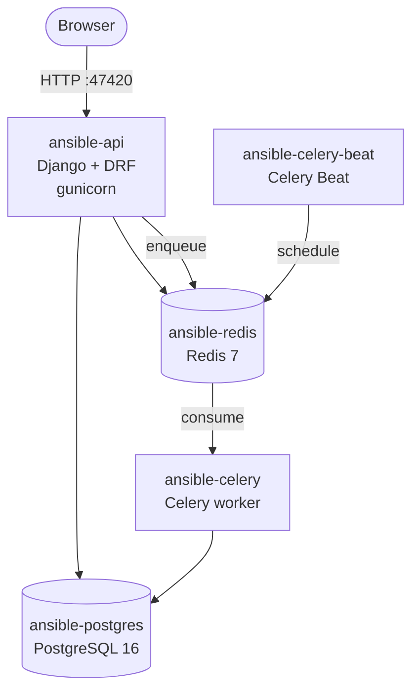
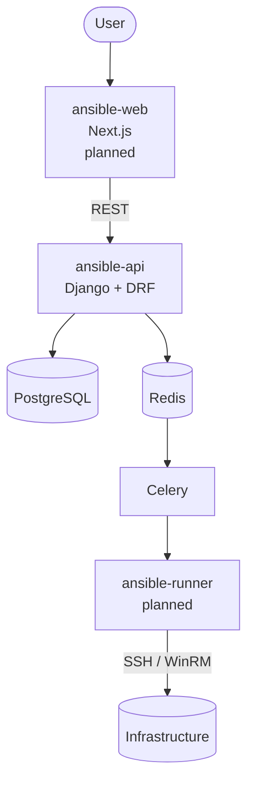
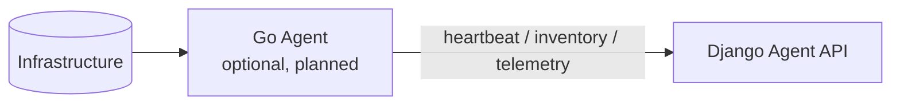

# Architecture

How the platform is built today, and where it is going. Anything not yet
implemented is labelled *planned* — no diagram here shows a component that does
not exist without saying so.

---

## Current architecture (Module 1)

Only `ansible-api` is reachable from the host. PostgreSQL and Redis are bound
to the `ansible-network` bridge and published nowhere.

## Target architecture

## Optional agent (planned)

The agent is **never required**. The division of labour is deliberate:

| | Responsibility |
|---|---|
| **Ansible** | Change — automation, configuration, deployment, patching |
| **Agent** | Observe — heartbeat, inventory, telemetry, status |

You can run the entire platform with Ansible alone.

---

## Application layout

| App | Responsibility | Status |
|---|---|---|
| `core` | Django project: settings, URLs, WSGI/ASGI, Celery app, health endpoint | Implemented |
| `commun` | Shared abstract base models only — not a dumping ground for helpers | Implemented |
| `authentication` | Session authentication today; RBAC, roles and permissions planned | Partial |
| `audit` | Audit trail, request-ID middleware, secret redaction | Implemented |
| `security` | Security event records; enforcement planned | Partial |
| `ipintel` | IP intelligence with pluggable providers | Implemented |
| `settings_platform` | Database-backed operational settings | Implemented |

## Request lifecycle

1. `SecurityMiddleware` applies transport-security headers.
2. `CorsMiddleware` evaluates the origin against an allow-list that is empty by
   default.
3. Session and authentication middleware resolve the user.
4. `RequestAuditContextMiddleware` accepts an inbound `X-Request-ID` or mints a
   UUID, publishes it to a `ContextVar`, and echoes it on the response.
5. The view runs. Log records emitted anywhere in the stack carry that request
   id, so a single request can be traced across API and worker logs.
6. The `ContextVar` is reset in a `finally` block — a worker thread never
   inherits a stale id.

## Data model foundations

Every platform model inherits `BaseModel`:

- `uuid` — an external, non-sequential identifier safe to expose over the API,
  so record counts are not leaked by enumerable integer ids;
- `created_at` / `updated_at` — indexed timestamps.

## Audit design

`AuditEvent` records who did what, to which resource, from where, with what
result.

Two decisions matter:

- **`username_snapshot` is stored alongside the `user` foreign key.** Deleting
  a user sets `user` to NULL; without the snapshot, the trail would forget who
  acted. An audit log that loses its subject is not an audit log.
- **Every JSON payload is redacted on save.** `previous_value`, `new_value` and
  `metadata` pass through `audit.sanitizers.sanitize`, which walks the
  structure and replaces credential-bearing keys. Redaction happens in
  `Model.save()`, not at the call site, so a future caller cannot forget.

Details: [docs/audit.md](docs/audit.md).

## Security boundaries

| Boundary | Enforcement |
|---|---|
| Infrastructure secrets | `.env` only — never the database, never the image |
| Operational settings | Database, with `is_secret` masking on display |
| Database and broker | Docker network only, never published |
| Container privileges | Unprivileged user, uid 10001 |
| API access | Authenticated and throttled by default |
| Audit payloads | Redacted before persistence |

Details: [docs/security.md](docs/security.md).

## Why these choices

Every significant decision has an Architecture Decision Record in
[docs/adr/](docs/adr/) recording the context, the decision, its consequences,
and what was rejected.

## Scaling

Not yet addressed, and deliberately so. The current deployment is a single
Compose stack; horizontal scaling, high availability and multi-node execution
are problems for after the platform does something useful. Documenting a
scaling story we have not tested would be fiction.
