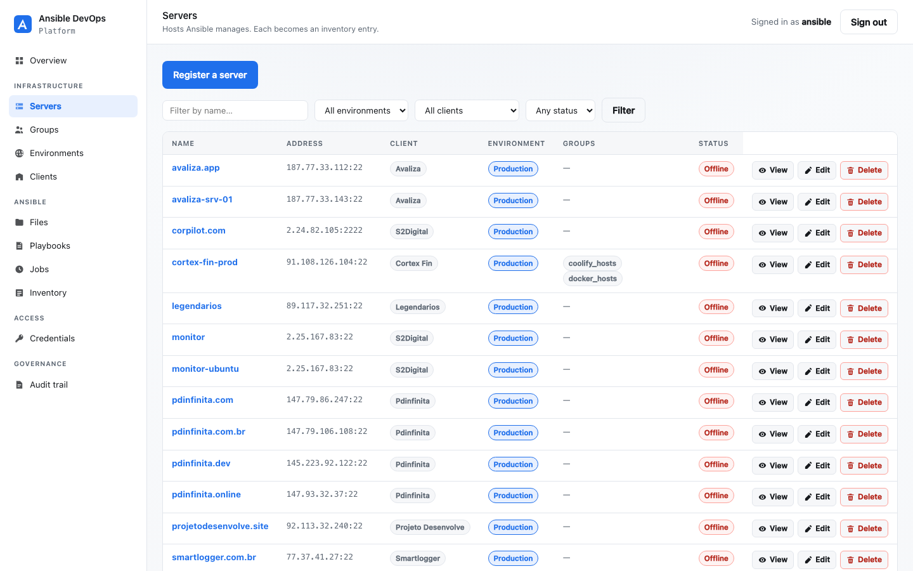

# Ansible DevOps Platform

[](LICENSE)
[](https://github.com/cosmeaf/ansible-devops-platform/actions/workflows/backend-ci.yml)
[](https://github.com/cosmeaf/ansible-devops-platform/actions/workflows/docker-build.yml)
[](https://www.python.org/downloads/)
[](https://www.djangoproject.com/)

An open-source, self-hosted platform for DevOps automation and infrastructure
management, powered by Ansible.

> **Project status: Alpha — early development.**
> The core platform and the Ansible module are implemented: infrastructure,
> workspace, inventory generation and playbook execution all work end to end.
> The web interface is server-rendered; the Next.js module is still planned.
> Not yet suitable for production use.



<p align="center">
  <sub>Managing Ansible infrastructure from the platform.
  <a href="docs/interface.md">Every screen</a></sub>
</p>

---

## What this is

Managing infrastructure with Ansible works well until you need the things
Ansible itself does not provide: who ran what and when, role-based access for a
team, a shared inventory, scheduled runs, and an auditable history of every
change. Teams usually end up with a pile of shell scripts, a cron server and a
shared SSH key.

Ansible DevOps Platform is the layer around Ansible that supplies those pieces —
self-hosted, auditable, and API-first — without replacing Ansible or locking you
into a proprietary format.

## What this is not

- **Not a replacement for Ansible.** Playbooks, roles and inventories stay
  standard Ansible YAML. If you stop using this platform, your automation still
  runs.
- **Not a SaaS.** You run it on your own infrastructure.
- **Not production ready.** See the status badge above and [ROADMAP.md](ROADMAP.md).

---

## Feature status

Nothing below is marked available unless it exists in this repository today.

### Available

- ✓ Django 5 + Django REST Framework backend
- ✓ PostgreSQL as the primary database
- ✓ Redis broker and cache
- ✓ Celery worker and Celery Beat scheduler
- ✓ Audit trail foundation with automatic secret redaction
- ✓ Security event model
- ✓ IP intelligence with a pluggable, offline-capable provider
- ✓ Database-backed platform settings with secret masking
- ✓ Role-based access control — five system roles, permissions resolved
      through roles, `is_staff`/`is_superuser` derived rather than hand-set
- ✓ Ansible infrastructure management at `/manage/` — register servers from the
      web or the API, with clients, groups and environments, mapping directly
      onto a standard Ansible inventory
- ✓ SSH, WinRM and (planned) agent connection methods across Linux, Windows,
      AIX, Solaris, HP-UX, BSD, macOS and network devices
- ✓ Encrypted credential storage — write-only secrets that can never be read back
- ✓ Playbook execution through Ansible Runner on Celery, with check mode,
      --limit, tags and extra vars; every run recorded as a Job with its
      play recap, exit code and output
- ✓ Connection test per server, using Ansible's own ping / win_ping, updating
      the server's status and last successful connection
- ✓ Workspace file explorer — browse the Ansible project as a folder tree,
      create, edit, rename and delete files and folders; YAML validated as
      what it is, so group_vars is not judged as a playbook
- ✓ Audit trail interface at `/manage/audit/` — who did what, when and from
      where, filterable by person, action, module and resource, with the
      history of each object shown on its own page
- ✓ Standard Ansible YAML inventory generated from the registered servers,
      viewable and downloadable at `/manage/inventory/` or written to a file
      with `python manage.py generate_inventory`
- ✓ Import an existing `~/.ssh/config` as inventory, including its banner
      comments as clients — `python manage.py import_ssh_config`
- ✓ REST API at `/api/v1/` for servers, clients, groups, environments and
      credentials, with filtering, search and audit on every write
- ✓ Session authentication
- ✓ Health endpoint reporting database and Redis state
- ✓ Request-ID correlation across responses and logs
- ✓ Docker Compose deployment with a private service network
- ✓ Idempotent bootstrap that generates every secret for you

### Planned

- ○ Next.js web UI (`ansible-web`) — Module 2
- ○ Infrastructure inventory (`InfrastructureAsset`)
- ○ Credential storage with envelope encryption
- ○ Job scheduling, live logs and run history
- ○ Git-backed playbook repositories
- ○ Optional Go agent for heartbeat and inventory
- ○ Network devices, VMware, Kubernetes, cloud and storage targets

---

## Quick start

**Requirements:** Docker and Docker Compose. Nothing else.

```bash
git clone https://github.com/cosmeaf/ansible-devops-platform.git
cd ansible-devops-platform
chmod +x scripts/bootstrap.sh
./scripts/bootstrap.sh
```

The bootstrap script generates every secret for you — you never invent a
password. It is idempotent: running it again will not overwrite your `.env`,
reset the admin password, or destroy data.

When it finishes:

| What | Where |
|---|---|
| Platform | <http://localhost:47420> |
| Django Admin | <http://localhost:47420/admin/> |
| Health | <http://localhost:47420/api/v1/health/> |

### Accounts

Two accounts are created, with deliberately different reach:

| Account | Role | Platform `/manage/` | Django Admin |
|---|---|---|---|
| `admin` | Administrator | ✅ | ✅ |
| `ansible` | Operator | ✅ | 🚫 denied |

Passwords are generated during installation — you never invent one. Read them
with:

```bash
grep INITIAL_ .env
```

The platform account **cannot reach Django Admin at all**: its role does not
grant `is_staff`, so `/admin/` redirects it away. That is enforced by tests, not
by hiding a link.

PostgreSQL and Redis are **not** published to the host — they are reachable only
from inside the `ansible-network` bridge.

---

## Docker

```bash
docker compose up -d        # start
docker compose ps           # status
docker compose logs -f      # follow logs
docker compose down         # stop, keeping data
```

> `docker compose down -v` **destroys your database volume.** It is not a normal
> operation. See [docs/docker.md](docs/docker.md).

---

## Repository structure

```text
.
├── core/                  Django project: settings, URLs, WSGI/ASGI, Celery, health
├── authentication/        Roles, RBAC backend, management interface
├── commun/                Shared abstract base models (UUID, timestamps)
├── audit/                 Audit trail, request-ID middleware, secret redaction
├── security/              Security event records
├── ipintel/               IP intelligence models and provider abstraction
├── infrastructure/        Servers, clients, groups, environments
├── inventory/             Ansible inventory generation from the registered servers
├── automation/            Workspace, playbook editor and the Ansible Runner engine
├── jobs/                  Job model, execution tasks and run history
├── credentials/           Encrypted SSH / become credentials
├── settings_platform/     Database-backed operational settings
├── tests/                 Test suite (runs against real PostgreSQL)
├── templates/             Minimal server-rendered pages
├── docker/django/         Application Dockerfile
├── scripts/bootstrap.sh   Idempotent installer and secret generator
└── docs/                  Documentation, including architecture decision records
```

---

## Technology stack

| Layer | Choice | Status |
|---|---|---|
| Backend | Django 5, Django REST Framework | Implemented |
| Database | PostgreSQL 16 | Implemented |
| Queue | Celery 5 | Implemented |
| Broker / cache | Redis 7 | Implemented |
| Containers | Docker Compose | Implemented |
| Frontend | Next.js | Planned — separate module |
| Automation | Ansible Runner | Planned — separate module |
| Agent | Go | Planned — optional, separate module |

Every choice is recorded with its reasoning in [docs/adr/](docs/adr/).

---

## Security

- Secrets live in `.env`, generated automatically, never committed, and excluded
  from container images via `.dockerignore`.
- The audit trail redacts passwords, tokens, keys, cookies and authorization
  headers before anything is written to the database.
- PostgreSQL and Redis are not exposed outside the Docker network.
- Containers run as an unprivileged user.
- DRF endpoints require authentication and are throttled by default.
- Authorisation comes from roles; `is_staff` and `is_superuser` are derived,
  never set by hand.
- Django Admin is an operator backdoor, not product surface — no platform page
  links to it.
- The health endpoint returns booleans only — never hostnames or credentials.

Found a vulnerability? **Do not open a public issue.** Follow
[SECURITY.md](SECURITY.md).

---

## Documentation

| Document | Purpose |
|---|---|
| [docs/getting-started.md](docs/getting-started.md) | First run, start to finish |
| [docs/installation.md](docs/installation.md) | Installation and requirements |
| [docs/configuration.md](docs/configuration.md) | Every environment variable |
| [docs/architecture.md](docs/architecture.md) | How the pieces fit together |
| [docs/development.md](docs/development.md) | Working on the code |
| [docs/docker.md](docs/docker.md) | Container operations |
| [docs/interface.md](docs/interface.md) | The management interface, with screenshots |
| [docs/security.md](docs/security.md) | Security model and posture |
| [docs/audit.md](docs/audit.md) | The audit trail |
| [docs/authentication.md](docs/authentication.md) | Authentication, today and planned |
| [docs/troubleshooting.md](docs/troubleshooting.md) | When something breaks |
| [ARCHITECTURE.md](ARCHITECTURE.md) | Architecture overview and diagrams |
| [docs/adr/](docs/adr/) | Architecture decision records |

---

## Development

```bash
python3.12 -m venv .venv && source .venv/bin/activate
pip install -r requirements-dev.txt

docker compose -f docker-compose.yml -f docker-compose.dev.yml \
    up -d ansible-postgres ansible-redis

export POSTGRES_HOST=127.0.0.1 POSTGRES_PORT=47432
export REDIS_HOST=127.0.0.1 REDIS_PORT=47379

python manage.py migrate
python manage.py runserver
```

Full instructions: [DEVELOPMENT.md](DEVELOPMENT.md). A `Makefile` wraps the
common commands — run `make help`.

## Testing

```bash
make test      # or: pytest
```

Tests run against real PostgreSQL, never SQLite, so they catch incompatibilities
that would otherwise surface only in deployment.

---

## Roadmap

Module 1 (this repository) is `0.1.0`. Web UI, Ansible execution, infrastructure
inventory and the optional Go agent follow. Full plan, with no invented dates:
[ROADMAP.md](ROADMAP.md).

## Contributing

Contributions are welcome. Start with [CONTRIBUTING.md](CONTRIBUTING.md), and
look for issues labelled `good-first-issue`.

## Code of Conduct

This project follows the [Contributor Covenant](CODE_OF_CONDUCT.md).

## Security reporting

Private disclosure process: [SECURITY.md](SECURITY.md).

## Support

Where to ask what: [SUPPORT.md](SUPPORT.md).

## Governance

How decisions get made: [GOVERNANCE.md](GOVERNANCE.md).

## Community

- **Discussions** — questions, ideas, showing what you built
- **Issues** — confirmed bugs and scoped feature requests
- **Security advisories** — private vulnerability reports

## License

Licensed under the [Apache License 2.0](LICENSE). You may use, modify,
distribute and build commercial products on it, subject to the license terms.
