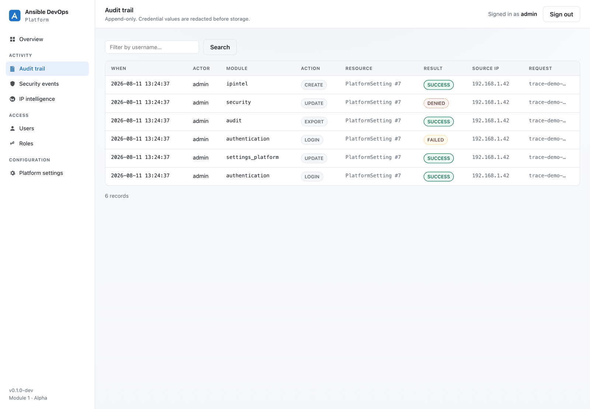
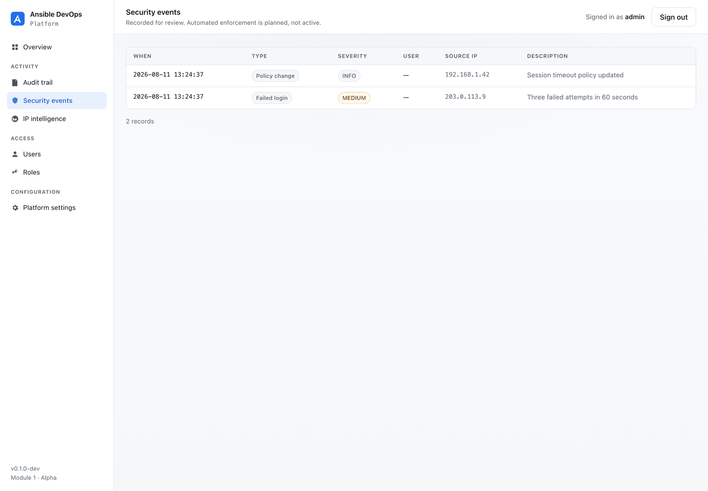
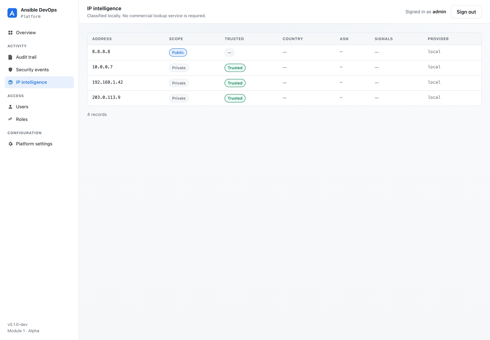
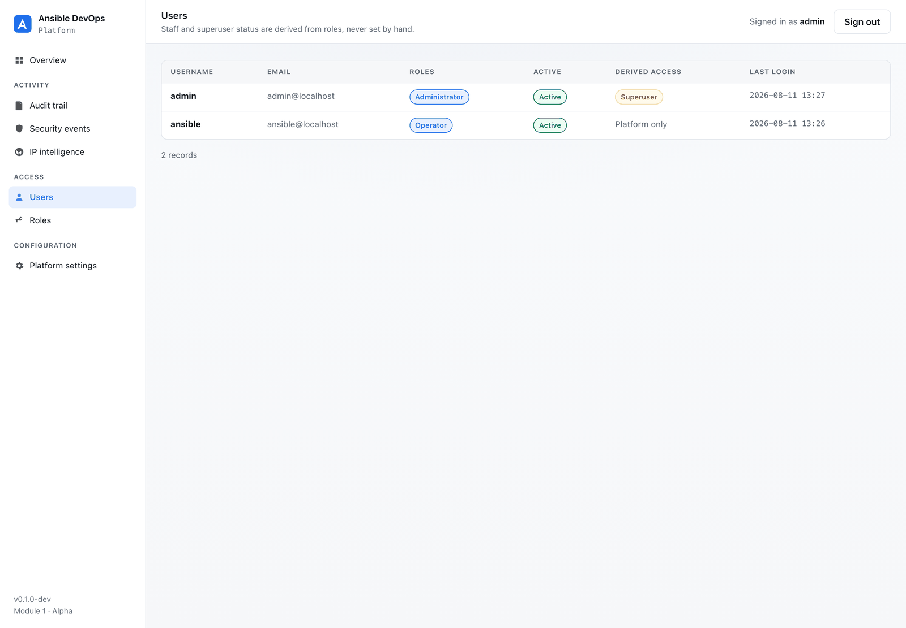
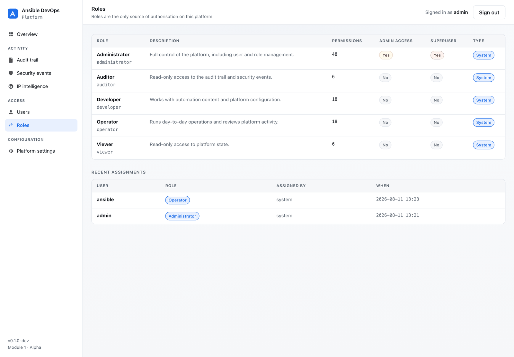
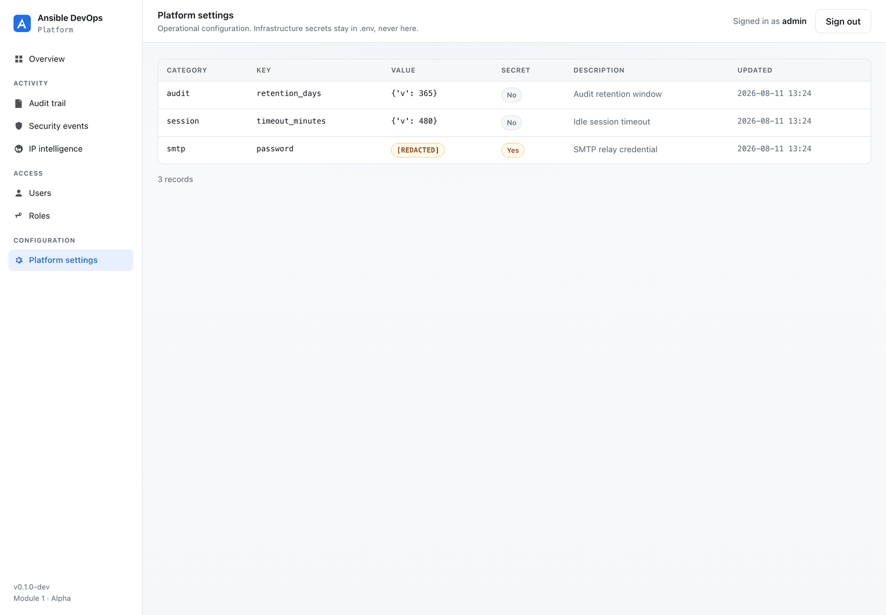
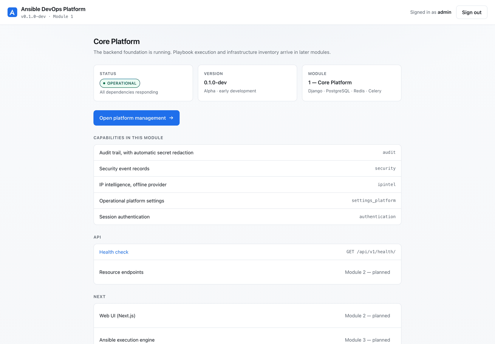

# The platform interface

Module 1 ships a server-rendered management interface. It is the platform's
**own** UI — it never links to, or depends on, Django Admin.

> The production interface is the Next.js module (Module 2). This one exists so
> a fresh installation is usable and verifiable on day one. See
> [ADR 0004](adr/0004-nextjs-frontend-planned.md).

---

## Sign in

Two accounts are created at install time, and they are deliberately different:

| Account | Role | Platform UI | Django Admin |
|---|---|---|---|
| operator (default `admin`) | Administrator | ✅ | ✅ |
| platform (default `ansible`) | Operator | ✅ | 🚫 **denied** |

The platform account **cannot reach Django Admin at all** — not because a link
is hidden, but because its role does not grant `is_staff`. Requests to
`/admin/` are redirected away.

Passwords are generated at install time unless you configure them. See
[configuration.md](configuration.md#initial-accounts).

---

## Overview

Platform state at a glance: recorded activity, security events, known
addresses, users and roles — plus the roles *you* hold, so it is always
obvious what your access is based on.

---

## Audit trail

Every recorded action, newest first, filterable by user. Each row carries the
actor, module, action, resource, result, source address and request id — the
same request id returned in the `X-Request-ID` response header, so a UI event
can be traced straight into the logs.

**Credential values never appear here**, because they are never stored. Redaction
happens in the model layer before the row is written. See [audit.md](audit.md).

---

## Security events

Failed logins, blocked addresses, policy changes and session events, with
severity.

> These are **recorded, not enforced**. Automated lockout and IP blocking are
> roadmap items — the interface does not imply protection that does not exist.

---

## IP intelligence

Addresses the platform has seen, classified as public or private, with proxy
and VPN signals where a provider supplies them.

Classification is **local and offline**. No commercial subscription is needed,
and nothing is sent to a third party. See
[ADR 0009](adr/0009-ipintel-provider-abstraction.md).

---

## Users

Every account, the roles it holds, and the access those roles *derive*.

Note the "Derived access" column: `is_staff` and `is_superuser` are computed
from roles and resynchronised whenever an assignment changes. They are never
set by hand — roles are the only source of authorisation.

---

## Roles

Five system roles ship with the platform:

| Role | Permissions | Django Admin |
|---|---|---|
| **Administrator** | Everything, including users and roles | Yes |
| **Operator** | Operate platform resources | No |
| **Developer** | Work with configuration and content | No |
| **Auditor** | Read audit and security records | No |
| **Viewer** | Read platform state | No |

Only Administrator opens Django Admin. Custom roles can be created with any
combination of model permissions.

System roles cannot be deleted — a deployment must never be able to lock itself
out.

---

## Platform settings

Operational configuration held in the database.

Values flagged **secret** render as `[REDACTED]` in every listing. Infrastructure
secrets — the database password, the Django secret key, the encryption key —
are **not** stored here at all; they live in `.env`. See
[security.md](security.md).

---

## Landing page

The signed-in landing page: platform status, version, what this module provides,
and what is coming. It links into the management area — never into Django Admin.

---

## Django Admin

Django Admin remains available at `/admin/`, restricted to accounts whose role
grants admin access.

It is an **operator backdoor for running the platform**, not part of the
product. Nothing in the platform interface links to it, and the Next.js module
will not either. See
[ADR 0012](adr/0012-admin-is-not-product-surface.md).

---

## Accessibility and theming

The interface follows the operating system's light/dark preference, uses
semantic markup with real form labels, and keeps visible focus rings on every
interactive element. All screenshots above are in light mode; dark mode is the
same interface with the palette inverted.
