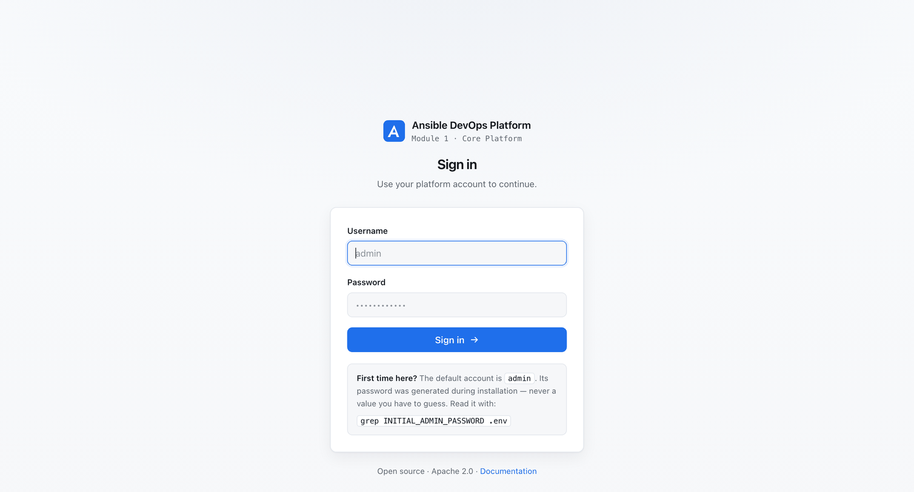
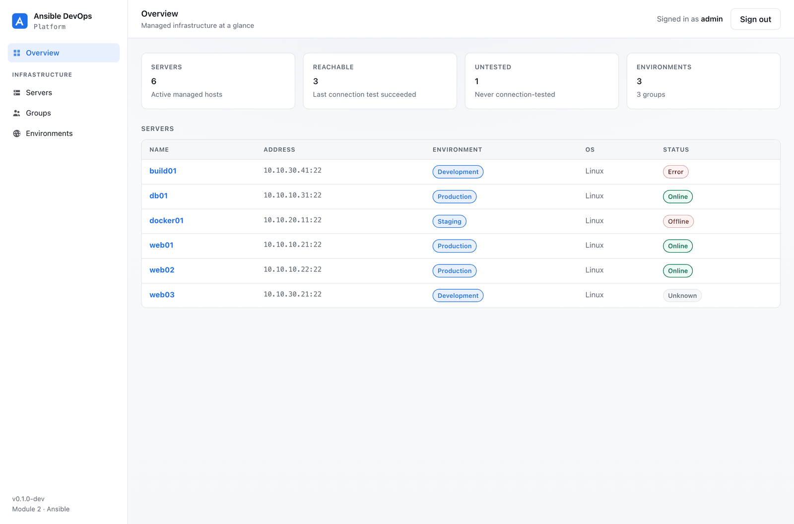
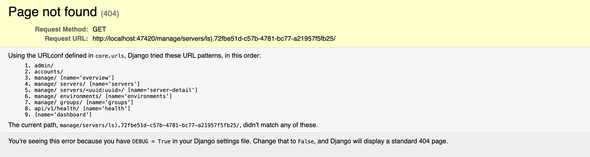
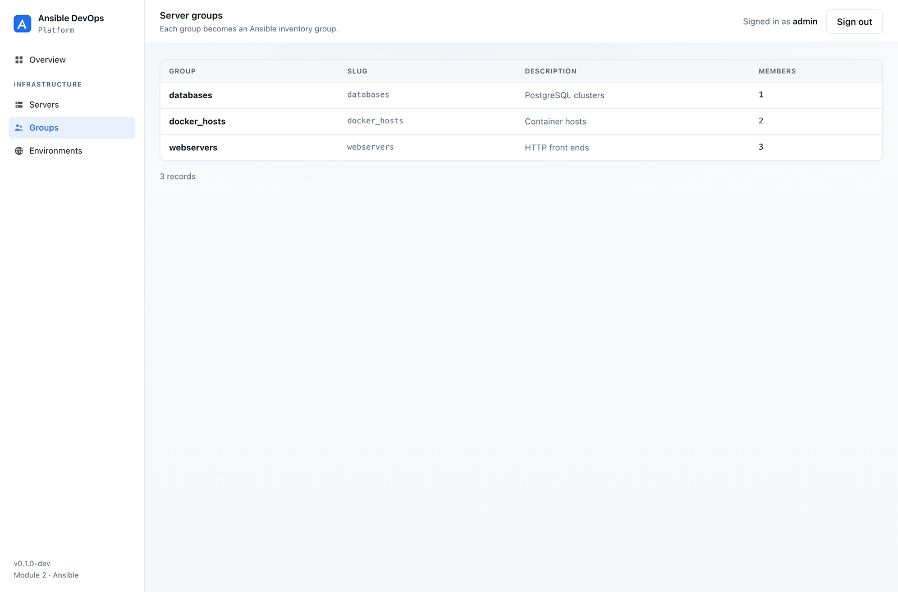
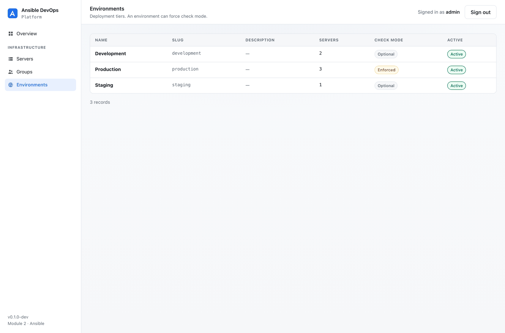

# The platform interface

The platform has two distinct surfaces, and the split is deliberate:

| Surface | Purpose | Audience |
|---|---|---|
| **`/manage/`** | **Managing Ansible** — servers, groups, environments, and (planned) inventories, playbooks and jobs | Everyone using the product |
| **`/admin/`** | Platform internals — audit trail, security events, IP intelligence, platform settings, users and roles | Operators only |

Signing in takes you **straight into Ansible management**. There is no landing
page in between, and nothing in the product surface links to Django Admin.

> The production interface is the Next.js module. These server-rendered screens
> exist so the platform is usable and verifiable today. See
> [ADR 0004](adr/0004-nextjs-frontend-planned.md) and
> [ADR 0012](adr/0012-admin-is-not-product-surface.md).

---

## Sign in

Two accounts are created at install time, with deliberately different reach:

| Account | Role | `/manage/` | `/admin/` |
|---|---|---|---|
| operator (default `admin`) | Administrator | ✅ | ✅ |
| platform (default `ansible`) | Operator | ✅ | 🚫 **denied** |

The platform account **cannot reach Django Admin at all** — not because a link
is hidden, but because its role does not grant `is_staff`. Requests to
`/admin/` are redirected away.

---

## Overview

The state of your managed infrastructure: how many servers exist, how many are
reachable, how many have never been connection-tested, and how they are spread
across environments.

"Untested" is called out on purpose — a host the platform has never reached is
not the same as a healthy one, and the interface should not let that hide.

---

## Servers

Every managed host, filterable by name, environment and status.

A server maps directly onto an Ansible inventory host. `name` is the inventory
hostname; the address, port and user become `ansible_host`, `ansible_port` and
`ansible_user`.

Status is only ever set by a real connection test — it is never assumed.

---

## Server detail

Per-host detail, including **exactly what this server contributes to an Ansible
inventory**. Those variables are standard Ansible; they work with
`ansible-playbook` directly, with or without this platform.

---

## Groups

Server groups become Ansible inventory groups — `webservers`, `databases`,
`docker_hosts`. Nothing proprietary: a group here is a group in the generated
inventory.

---

## Environments

Deployment tiers. An environment can be marked **check mode enforced**, which
restricts every job against it to a dry run — the guard rail you want on
production before you trust the platform.

---

## Platform internals

Audit, security events, IP intelligence, platform settings, users and roles are
managed in **Django Admin** at `/admin/`, restricted to accounts whose role
grants admin access.

They are operator concerns, not part of managing Ansible, which is why they are
not in the product surface. The audit trail remains read-only even there — see
[audit.md](audit.md).

---

## Accessibility and theming

The interface follows the operating system's light/dark preference, uses
semantic markup with real form labels, and keeps visible focus rings on every
interactive element. Screenshots above are light mode.
